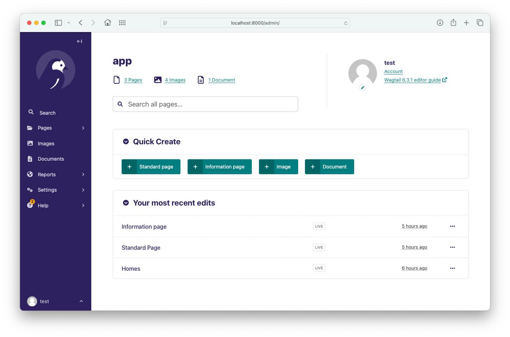
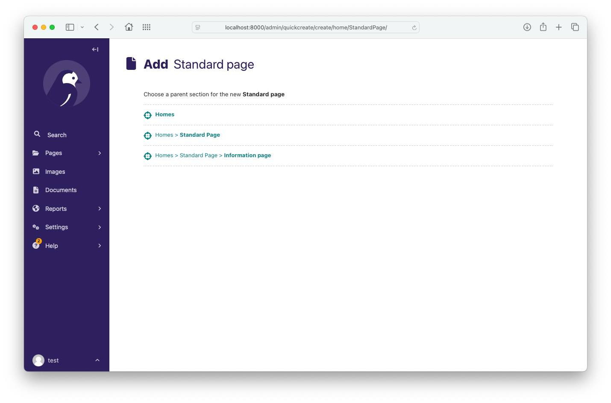

# Wagtail Quick Create

**Add shortcut links to the admin Home page** create objects from models specified in your settings file.

A panel is added to the admin home, offering a model type:



Clicking a create link will bring to the generic Wagtail add page for the model type:



## Note on parent pages

Wagtailquickcreate needs the [`parent_page_types`](http://docs.wagtail.io/en/v2.5.1/reference/pages/model_reference.html#wagtail.core.models.Page.parent_page_types) set on the model you wish to include so it can successfully provide the parent page selection. If this isn't specified, you will likely see every page offered as a parent, this will not work as it's looking up pages using `wagtail.core.models.Page` and this core wagtail class has `is_creatable = False`

### Configuration

Install using pip:

```bash
pip install wagtail-quick-create
```

After installing the module, add `wagtailquickcreate` to your installed apps in your settings file:

```python
INSTALLED_APPS = [
    ...
    'wagtailquickcreate',
]
```

Also add the models you would like to create quick links for to your settings file as `'your_app_name.YourModelName'`:

example setting:

```python
WAGTAIL_QUICK_CREATE_PAGE_TYPES = ['news.NewsPage', 'events.EventPage']
```

If you would like to offer image and or document links, this can also be done by specifying the following in your settings:

```python
WAGTAIL_QUICK_CREATE_DOCUMENTS = True
WAGTAIL_QUICK_CREATE_IMAGES = True
```

### Customising the panel

The panel is not collapsed by default, but you can collapse it by adding the following to your settings:

```python
WAGTAIL_QUICK_CREATE_INITIAL_COLLAPSED = True
```

## Compatibility

This package is compatible with Wagtail 6.3 and above.

If you are using a version of Wagtail below 6.3, you can use the [2.0.1](https://pypi.org/project/wagtail-quick-create/2.0.1/) release of this package.

## Contributing

We are happy to receive pull requests for bug fixes, improvements and new features. See [CONTRIBUTING.md](./docs/CONTRIBUTING.md) for more information.

## Credits/Authors

Concept created by Kate Statton - NYPR [@katestatton](https://twitter.com/katestatton)
